An interactive, console-based chatbot that leverages an agentic architecture and maintains persistent, long-term memory across conversations.
## Features

- **🧠 Persistent Long-Term Memory**: Remembers key details across multiple sessions using a sophisticated hybrid memory system.
- **🧩 Agentic Architecture**: Utilizes a stateful graph (`LangGraph`) to orchestrate complex interactions and tool use, allowing for more intelligent and context-aware responses.
- **💻 Interactive Console UI**: A clean, colorful, and user-friendly interface built with `rich` console.
- **🔧 Simple Command Interface**: Easily manage conversations and memory with intuitive commands.

## Core Architecture

The chatbot's logic is built on a stateful graph that orchestrates interactions and tool usage. This allows the agent to intelligently decide when to access its long-term memory based on the conversation's context.

The long-term memory layer is managed by **`mem0`**, an open-source library that orchestrates a hybrid memory system using two distinct backend services:

- **Vector Memory (Qdrant):** Enables fast, semantic search over conversation history.
- **Graph Memory (Neo4j):** Constructs a knowledge graph of entities (e.g., people, places, preferences) and their relationships for precise, factual recall.

This dual-component memory allows the agent to retrieve both contextually relevant information and specific, interconnected facts.



## Installation & Setup

Before you begin, ensure you have the following installed:
- **Python** (3.10 or newer)
- **Docker**

#### 1. Clone the Repository

```
git clone https://github.com/astonishedrobo/agentic-chatbot.git
cd agentic-chatbot
```

#### 2. Configure Environment Variables

Create a `.env` file:
```
touch .env
```

Now, open the `.env` file and add your OpenAI API key:
```
# .env
OPENAI_API_KEY=<openai_api_key>
```

#### 3. Install Dependencies

It's recommended to use a virtual environment.
```
# Create and activate a virtual environment
python -m venv venv
source venv/bin/activate  # On Linux/MacOS

# Install required packages
pip install -r requirements.txt

# Or if you have uv installed (recommended)
# uv pip install -r requirements.txt
```

## Usage

Once all setup steps are complete, run the application:
```
python app.py
```
This should open an interactive console.

To login as a different user, run the following:
```
python app.py --relogin
```

## Commands

- `/new`: Starts a new, fresh conversation thread.
- `/clear`: Clears the long-term memory for the current user.
- `/commands`: Displays the list of available commands.
- `/exit`: Exits the chatbot session.

## Technology Stack

- **Agent & Orchestration**: `LangGraph`
- **Long-Term Memory**: `mem0`
- **Databases**: `Qdrant` (Vector), `Neo4j` (Graph)
- **Containerization**: `Docker`
- **Console UI**: `Rich`